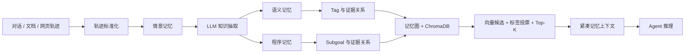

# AgentMemGraph

面向大语言模型 Agent 的结构化长期记忆服务。

AgentMemGraph 将对话、文档片段和 Agent 操作轨迹整理为三类记忆：保留原始证据的情景记忆（episodic memory）、可复用事实的语义记忆（semantic memory），以及任务流程与经验的程序记忆（procedural memory）。系统通过记忆图保存知识关系，在推理时仅召回与当前任务相关的紧凑上下文，减少重复注入完整历史轨迹。

## 核心能力

- 将 observation/action 轨迹抽取为 episodic、semantic、procedural 三类记忆。
- 使用 tag、subgoal 和证据关系组织记忆图。
- 支持 OpenAI 兼容的 LLM 与 Embedding 服务。
- 支持 NV-Embed-v2、自托管向量服务和 ChromaDB 持久化。
- 提供 FastAPI 接口、检索轨迹审计和 Memory Inspector。
- 支持为结构化、检索、推理、合并配置不同模型。
- 提供 LongMemEval、HotpotQA、WebArena 评测适配代码。
- 提供 OpenClaw 插件，将会话轨迹写入长期记忆并执行跨会话召回。

## 系统流程



当前核心检索采用向量相似度、标签候选和 Top-K 阈值过滤。HotpotQA 适配器额外实现多轮查询扩展；它不是沿图邻接边执行的通用多跳遍历。

## 目录结构

```text
AgentMemGraph/
├── agentmemgraph/                  # 可安装的 Python 包
│   ├── api/                        # FastAPI、Inspector 与接口模型
│   ├── clients/                    # LLM、Embedding 与模型路由
│   ├── core/                       # 记忆、节点、记忆图和评分函数
│   ├── inference/                  # 结构化与检索推理
│   ├── migration/                  # 旧格式数据迁移
│   ├── prompts/                    # Prompt 注册表
│   └── storage/                    # ChromaDB 存储层
├── host_local_inference/           # Qwen 与 NV-Embed-v2 部署脚本
├── openclaw-agentmemgraph-plugin/  # OpenClaw 插件
├── scripts/bench/                  # Token 成本实验工具
├── src/eval/                       # 三类评测适配器
├── tests/                          # API 与模型路由测试
└── examples/                       # 任务适配说明
```

`src/` 保留的是研究评测适配层，主要服务于基准复现；可复用的产品代码位于 `agentmemgraph/`。

## 环境要求

- Python 3.10+
- Node.js 18+（仅 OpenClaw 插件需要）
- CUDA GPU（仅本地部署大模型或 NV-Embed-v2 时需要）

## 安装

使用 `uv`：

```bash
uv sync --extra dev
```

或者使用标准虚拟环境：

```bash
python -m venv .venv
source .venv/bin/activate
python -m pip install -e ".[dev]"
```

如果需要在本机启动 NV-Embed-v2：

```bash
python -m pip install -e ".[local-inference]"
```

## 配置

服务通过环境变量读取配置：

```bash
# OpenAI 兼容的推理服务
export LLM_BASE_URL="http://127.0.0.1:8000/v1"
export LLM_API_KEY="local"
export LLM_MODEL="Qwen/Qwen2.5-7B-Instruct"

# OpenAI 兼容的向量服务
export EMBEDDING_BASE_URL="http://127.0.0.1:8001/v1/embeddings"
export EMBEDDING_MODEL="nvidia/NV-Embed-v2"

# ChromaDB
export CHROMA_MODE="persistent"
export CHROMA_PATH="./data/chroma"

# 可选：保护服务接口
export AGENTMEMGRAPH_API_KEY="change-me"
```

如需为不同阶段使用不同模型，可设置 `LLM_CONFIG_PATH` 指向 YAML 配置文件；支持 `structuring`、`retrieval`、`reasoning` 和 `consolidation` 四个角色。

## 启动服务

```bash
agentmemgraph --host 0.0.0.0 --port 8080
```

也可以直接使用模块入口：

```bash
python -m agentmemgraph --host 0.0.0.0 --port 8080
```

启动后可访问：

- API 文档：`http://127.0.0.1:8080/docs`
- Memory Inspector：`http://127.0.0.1:8080/inspector/`
- 健康检查：`http://127.0.0.1:8080/api/v1/health`

## 本地模型服务

启动 Qwen 推理服务：

```bash
MODEL_NAME="Qwen/Qwen2.5-7B-Instruct" \
bash host_local_inference/vllm_deploy.sh
```

启动 NV-Embed-v2 向量服务：

```bash
bash host_local_inference/nv_embed_v2_deploy.sh
```

## 最小使用流程

### 1. 创建记忆图

```bash
curl -X POST http://127.0.0.1:8080/api/v1/graphs \
  -H "Content-Type: application/json" \
  -H "X-API-Key: change-me" \
  -d '{"graph_id":"personal-memory"}'
```

### 2. 写入结构化记忆

```bash
curl -X POST http://127.0.0.1:8080/api/v1/graphs/personal-memory/memories \
  -H "Content-Type: application/json" \
  -H "X-API-Key: change-me" \
  -d '{
    "mode":"structured",
    "session_id":"demo-session",
    "semantic":[{
      "semantic_memory":"用户偏好在上午安排会议",
      "tags":["用户偏好","会议时间"]
    }]
  }'
```

### 3. 召回相关记忆

```bash
curl -X POST http://127.0.0.1:8080/api/v1/graphs/personal-memory/retrieve \
  -H "Content-Type: application/json" \
  -H "X-API-Key: change-me" \
  -d '{
    "observation":"用户喜欢什么时候开会？",
    "goal":"安排下一次会议",
    "mode":"semantic_memory"
  }'
```

### 4. 查看检索过程

```bash
curl -X POST http://127.0.0.1:8080/api/v1/graphs/personal-memory/recall_trace \
  -H "Content-Type: application/json" \
  -H "X-API-Key: change-me" \
  -d '{
    "observation":"用户喜欢什么时候开会？",
    "mode":"semantic_memory",
    "query_tags":["会议时间"]
  }'
```

## 主要接口

| 方法 | 路径 | 用途 |
| --- | --- | --- |
| `POST` | `/api/v1/graphs` | 创建记忆图 |
| `GET` | `/api/v1/graphs` | 列出记忆图 |
| `POST` | `/api/v1/graphs/{id}/memories` | 写入轨迹或结构化记忆 |
| `POST` | `/api/v1/graphs/{id}/retrieve` | 生成带记忆的推理 Prompt |
| `POST` | `/api/v1/graphs/{id}/reason` | 召回并调用推理模型 |
| `POST` | `/api/v1/graphs/{id}/consolidate` | 合并与整理语义记忆 |
| `POST` | `/api/v1/graphs/{id}/recall_trace` | 查看召回候选、评分和选择结果 |
| `GET` | `/api/v1/graphs/{id}/topology` | 获取记忆图拓扑 |

完整接口以启动后的 `/docs` 为准。

## OpenClaw 插件

```bash
cd openclaw-agentmemgraph-plugin
npm install
npm run build
```

插件注册两个工具：

- `agentmemgraph.remember`：写入事实或会话轨迹。
- `agentmemgraph.recall`：从一个或多个记忆图召回相关信息。

配置与自动记忆流程见 [OpenClaw 接入说明](openclaw-agentmemgraph-plugin/ONBOARDING.md)。

## 测试

```bash
pytest -q
```

OpenClaw 插件测试：

```bash
cd openclaw-agentmemgraph-plugin
npm test
```

## 评测

仓库提供 LongMemEval、HotpotQA 和 WebArena 的适配代码，但不内置大体量数据集及第三方运行环境。运行前需要按照 `examples/task-adaptation/` 中的说明准备数据和依赖。

评测结果至少应记录：

- 数据集版本与切分；
- 推理模型、结构化模型和向量模型；
- Top-K、阈值和多轮检索次数；
- 原始预测、指标文件和 Token usage；
- 基线实现与相同硬件/服务配置。

## 后续计划

- 增加异步写入队列与批量 Embedding Worker。
- 引入 Cross-Encoder 或 LLM reranker。
- 实现带访问预算的多跳子图检索。
- 统一三套基准的配置、日志和结果格式。
- 增加 Docker Compose 与端到端集成测试。


